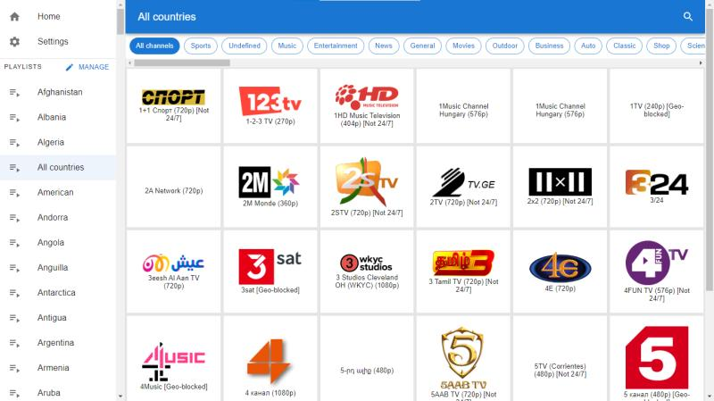
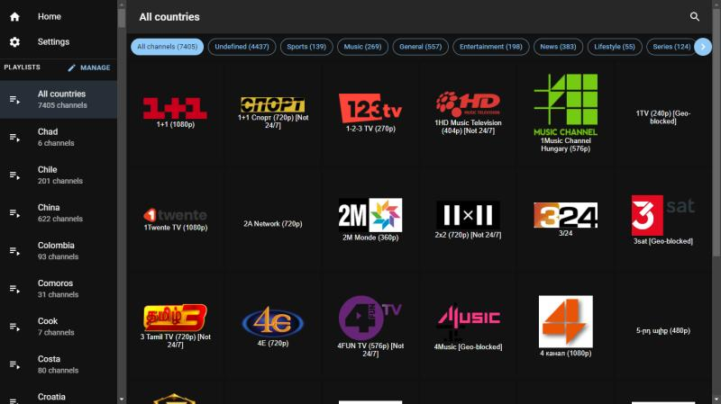
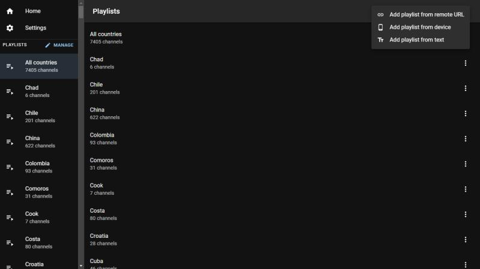
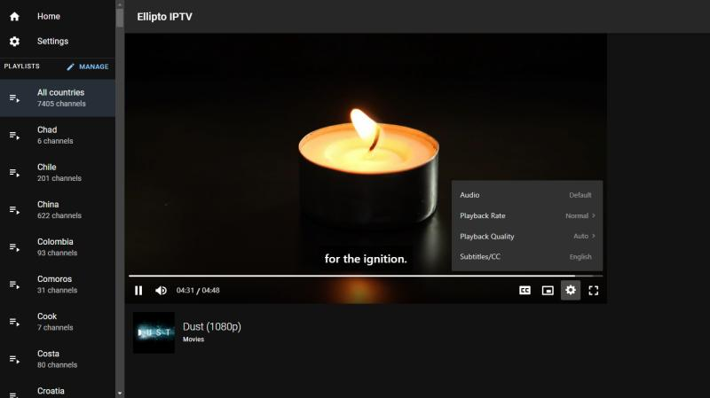
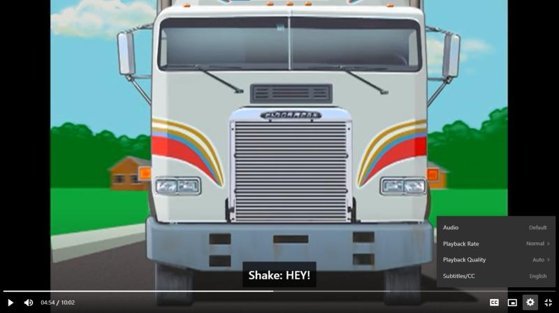

<h1 align="center" id="title">Ellipto IPTV</h1>

<div align="center"></div>
<br />

<div align="center"></div>

<p id="description">A progressive web app to watch m3u or m3u8 playlists with some awesome features</p>

<div align="center">
    &nbsp;
    &nbsp;
    
</div>

<a href="https://t.me/elliltoiptv">Join our Telegram channel for discussions</a>

<h2>🚀 Demo</h2>

[https://elliptoiptv.vercel.app/](https://elliptoiptv.vercel.app/)

<h2>🖼 Screenshots:</h2>

|                                 Home: Channel List - Light Mode                                 |                     Home: Channel List - Dark Mode                      |
| :---------------------------------------------------------------------------------------------: | :---------------------------------------------------------------------: |
|                               |          |
|                                      Playlists: Dark Mode                                       |                      Player: Controls - Dark Mode                       |
|                                        |  |
|                            Player: Fullscreen - Controls - Dark Mode                            |                                                                         |
|  |                                                                         |

<h2>🧐 Features</h2>

Here're some of the best features of Ellipto IPTV:

- M3u and M3u8 playlists support 📺
- Add playlists from local file system 📂
- Add playlists from remote URLs 🌐
- Categorize channels 🔠
- Search for channels 🔍
- Light and Dark theme 🌓

<h2>🛠️ Installation Steps:</h2>

<p>1. Install dependencies</p>

```
yarn install
```

<p>2. Run the app in the development mode</p>

```
yarn start
```

<p>3. Builds the app for production to the build folder</p>

```
yarn build
```

<h2>🛡️ License:</h2>

This project is licensed under the MIT

<h2>Disclaimer</h2>

Ellipto IPTV does not provide playlists.

<h2>💖Like my work?</h2>

Support me<p>https://buymeacoffee.com/</p>
